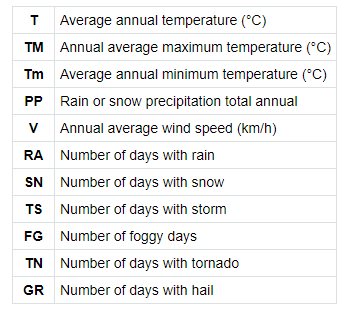
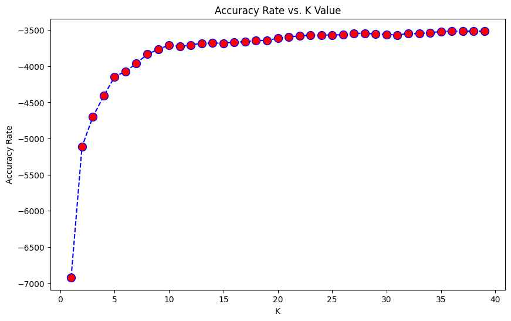
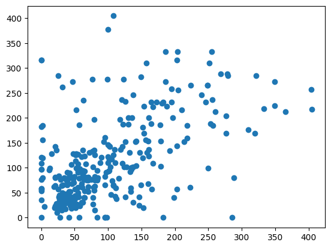
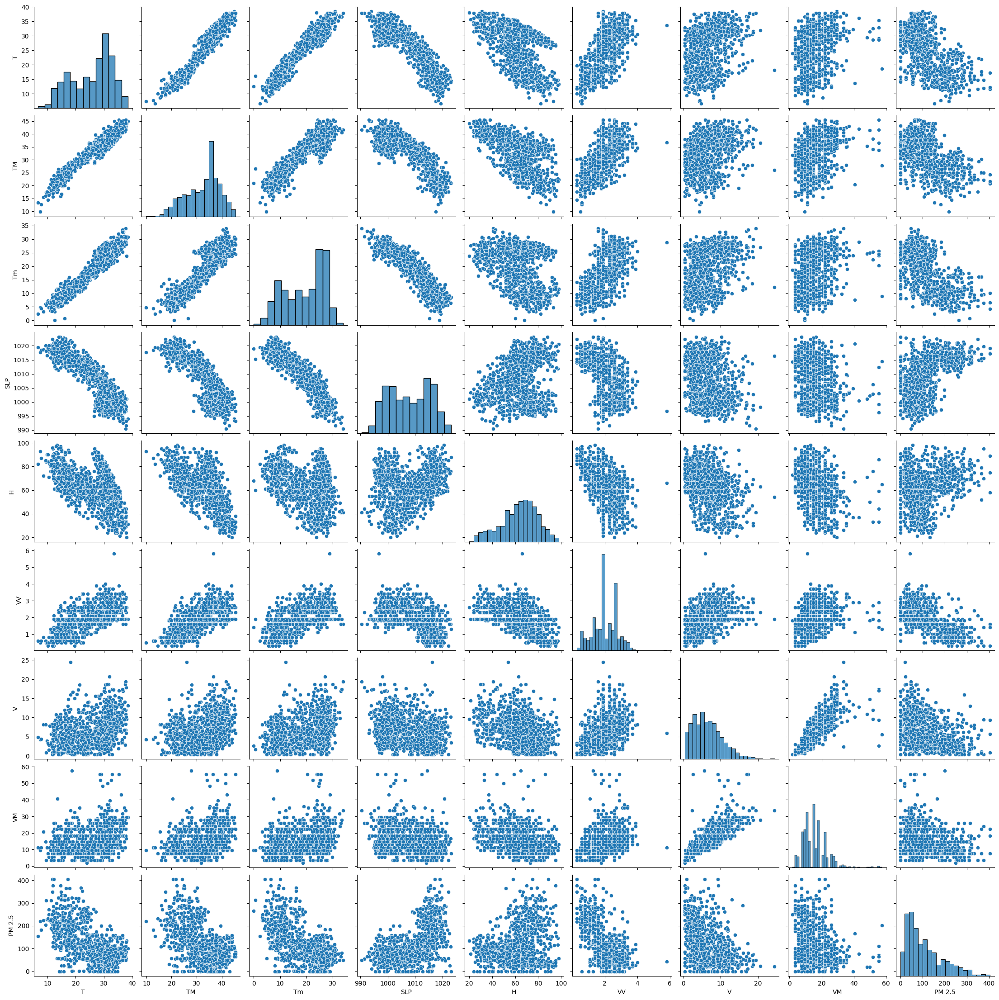
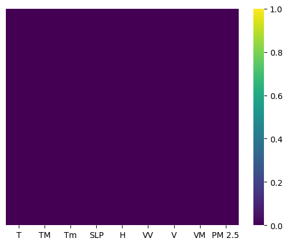

# **Air Quality Index**

As part of a data science study to forecast **India's air quality**, packages like Beautiful Soup are used to scrape data, cleansed, and run required algorithms to the resultant data collection to produce Machine Learning models.

## Use Case:

It can be used to build models that predict air quality, analyze trends, or even create visualizations to showcase the effects of air pollution.

## Key Learning Areas:

- Data Scraping
- Time series analysis
- Environmental data analysis
- Visualizations of the features provided T,TM,Tm,SLP,H,VV,V,VM.

### Visualizations:

### Visualization for null values check:

## Tech Stack:

- **Python**
- **Pandas**
- **BeautifulSoup**
- Data visualization libraries like **Matplotlib/Seaborn**.
